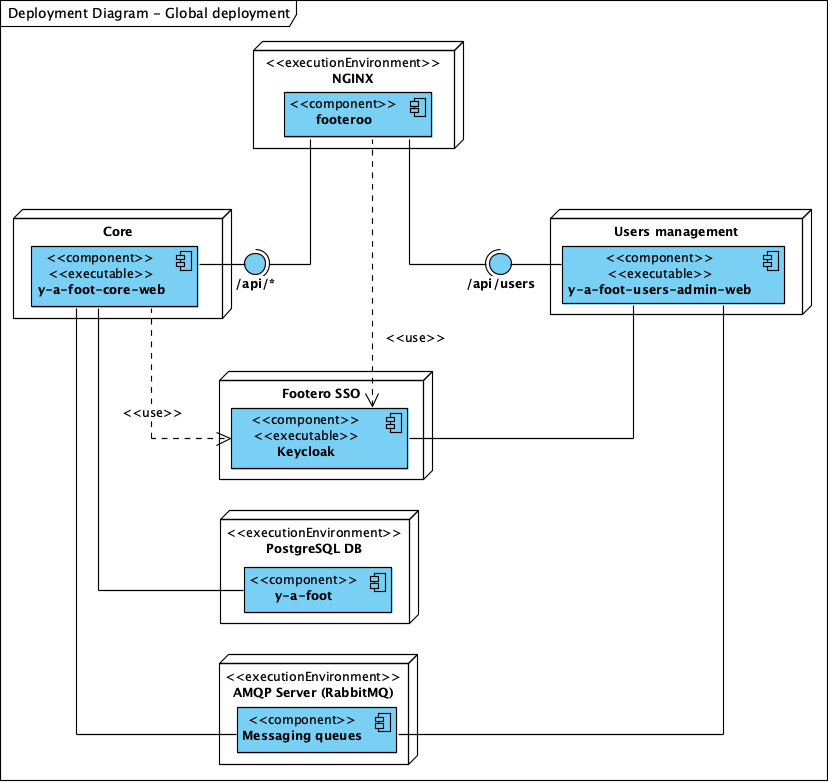
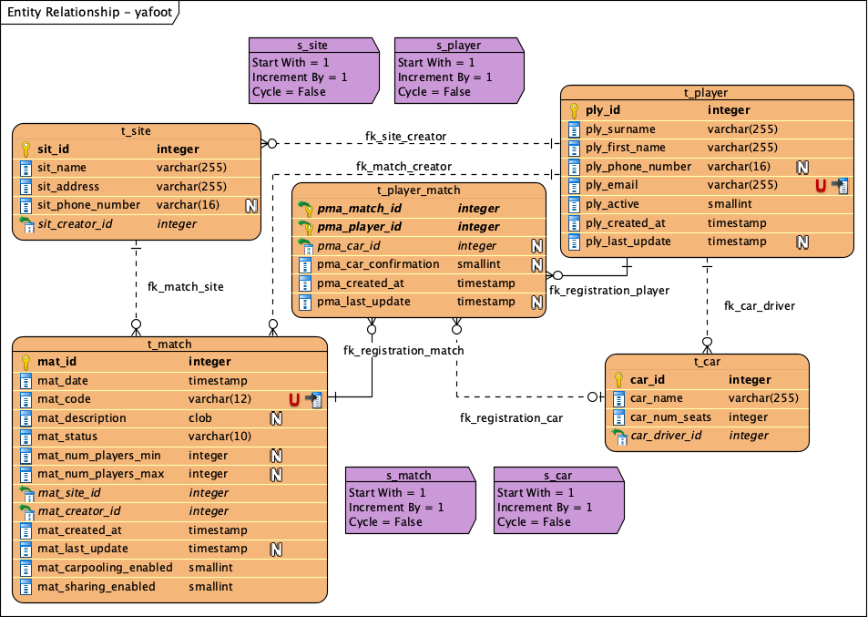

# Y'a foot !

*Y'a foot !* is an application for sport amateurs to manage logistics and organisation of matches between colleagues,
friends, classmates and so on.

## Technologies and frameworks

Some frameworks and libraries used in this application:

* Spring Boot 2.5
* Spring Framework 5.3
* Spring Security 5.5
* OpenAPI 3.0
* MyBatis 3.5
* JUnit 5.7

## Deployment

This is the global deployment diagram showing the main components of this project:

## Database model

## Required installation

### Minimum requirements for building

* JDK 14
* Maven 3.6

### Minimum requirements for deploying

* JRE 14
* PostgreSQL 12+
* OpenLDAP 3

### LDAP directory structure

Scripts to execute

    misc/ldap/01_create_structure.ldif
    
## Application deployment

In order to deploy `y-a-foot`, you must deploy `y-a-foot-core-web` (core module) as a Spring Boot JAR application as
well as `y-a-foot-users-admin-web` (users management module) and `y-a-foot-users-auth-web` (users authentication module)
