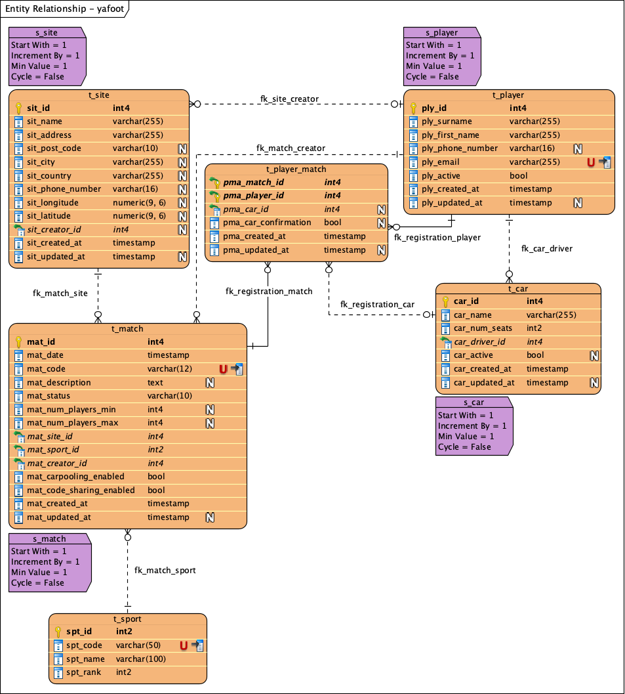

# Y'a foot !

*Y'a foot !* is an application for sport amateurs to manage logistics and organisation of matches between colleagues,
friends, classmates and so on.

## Technologies and frameworks

Some frameworks and libraries used in this application:

* Spring Boot 3.0
* Spring Framework 6.0
* Spring Security 6.0
* OpenAPI 3.0
* MyBatis 3.5
* JUnit 5.9
* RabbitMQ 3.12

## Deployment

This is the global deployment diagram showing the main components of this project:

## Database model

## Required installation

### Minimum requirements for building

* JDK 17
* Maven 3.9

### Minimum requirements for deployment

* JRE 17
* PostgreSQL 13+
* An external active directory with OAuth 2.0 support such as Keycloak
* RabbitMQ for handling internal events

### Keycloak directory structure

Realm structure to import on Keycloak:

    misc/keycloak/realm-export.json
    
## Application deployment

In order to deploy `y-a-foot`, you must deploy `y-a-foot-core-web` (core module) as a Spring Boot JAR application as
well as `y-a-foot-users-admin-web` (users management module)
